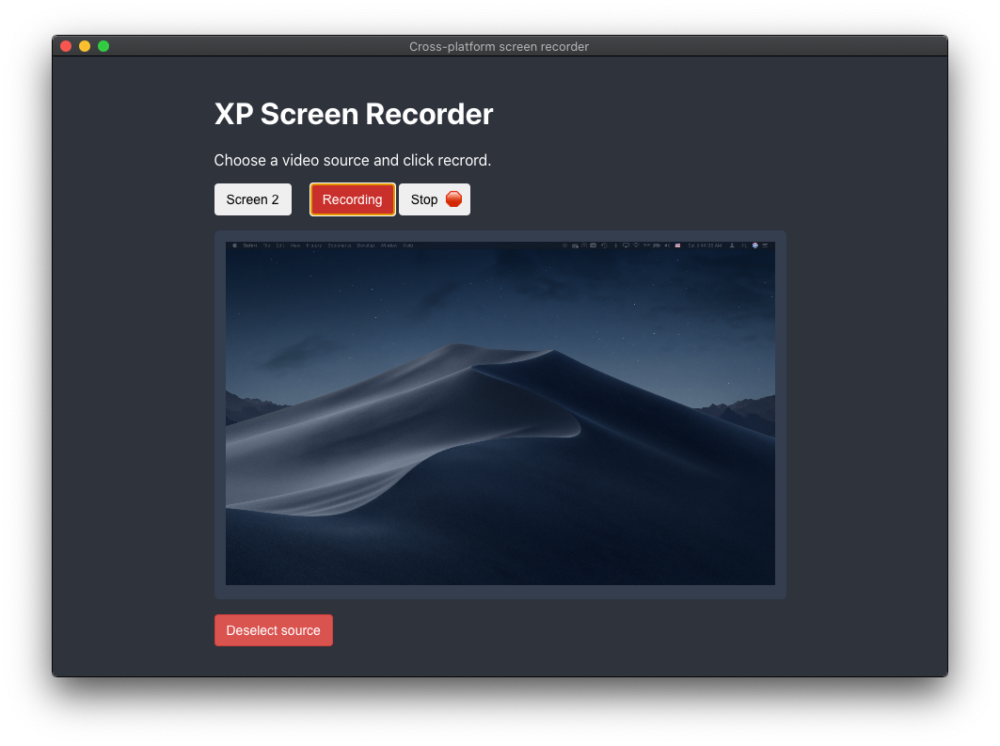

# Cross-platform screen recorder
xpscreen's native Mac app is available for Download from [releases](https://github.com/skylerspaeth/XP-Screen-Recorder/releases/).

 <!-- .element height="50%" width="50%" -->

To use in development mode, install dependencies with `npm install`.
Once those are installed, use `npm start` to run the app natively on your machine.

In order to build the project yourself, you must follow the same procedure as above, and run `npm run make`. This will result in your platform-specific binary being complied to the `./out` subdirectory.
